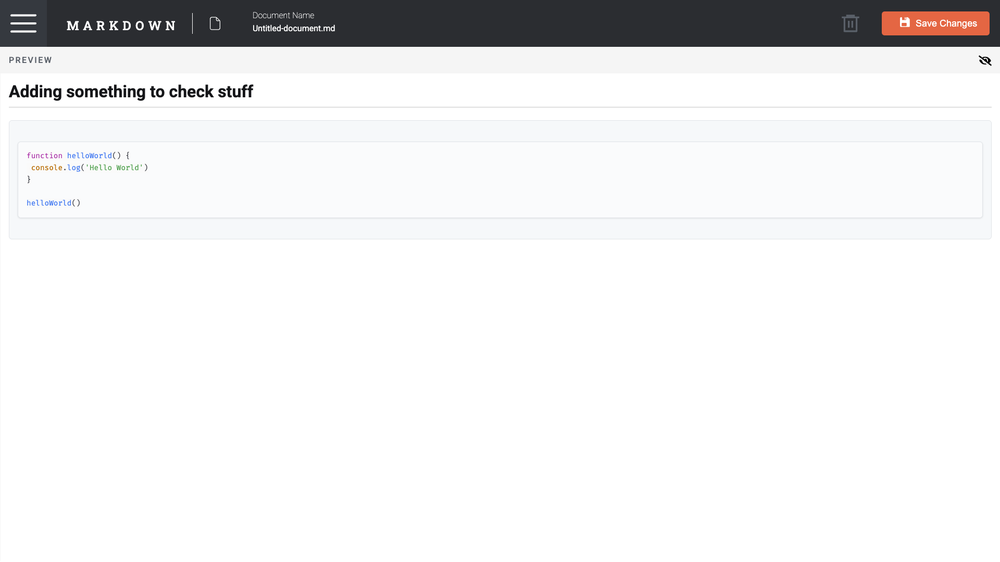
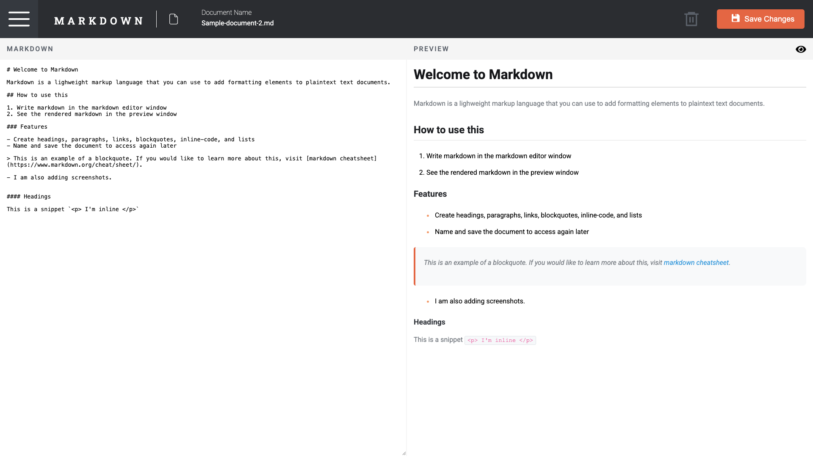
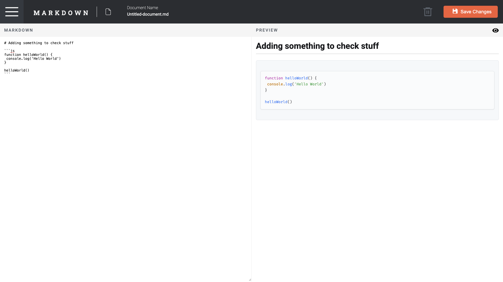
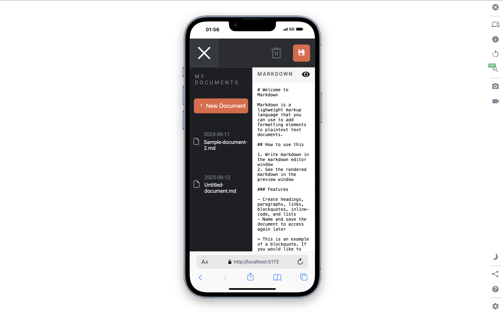
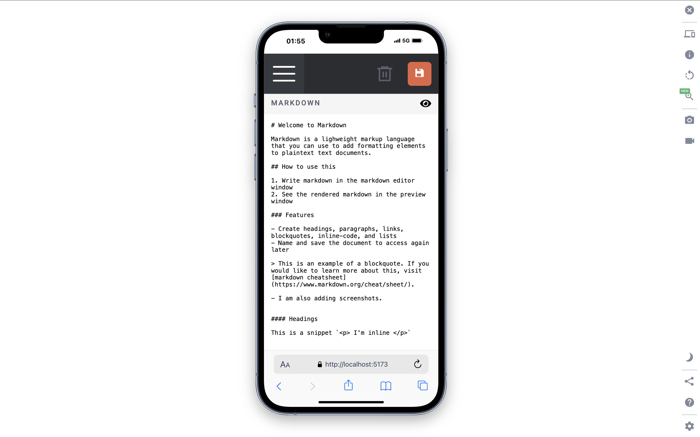
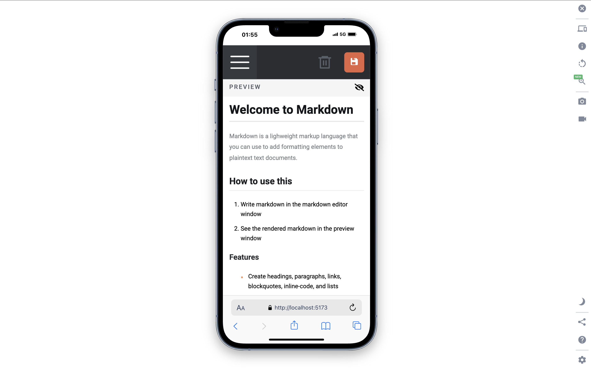
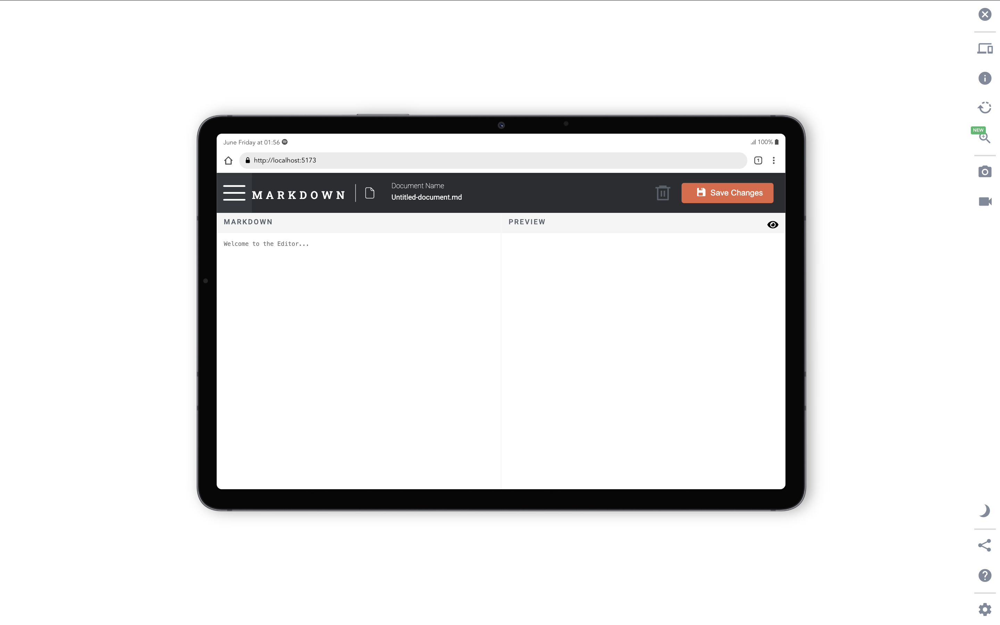
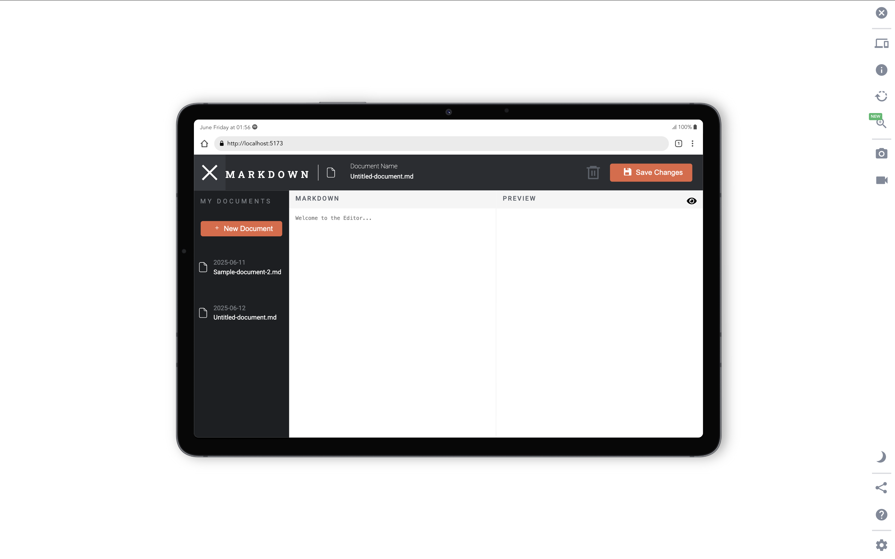
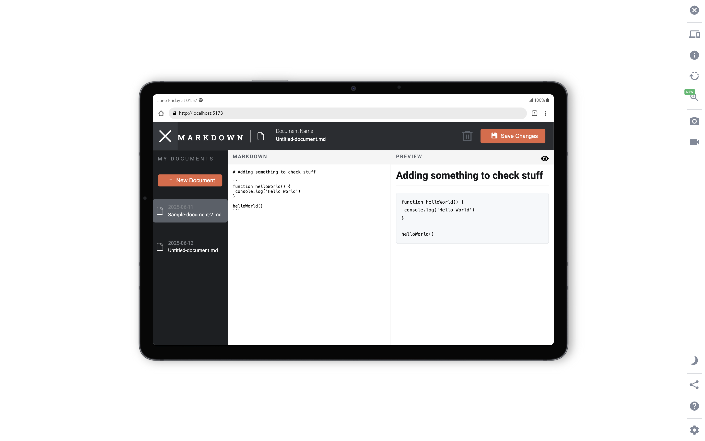
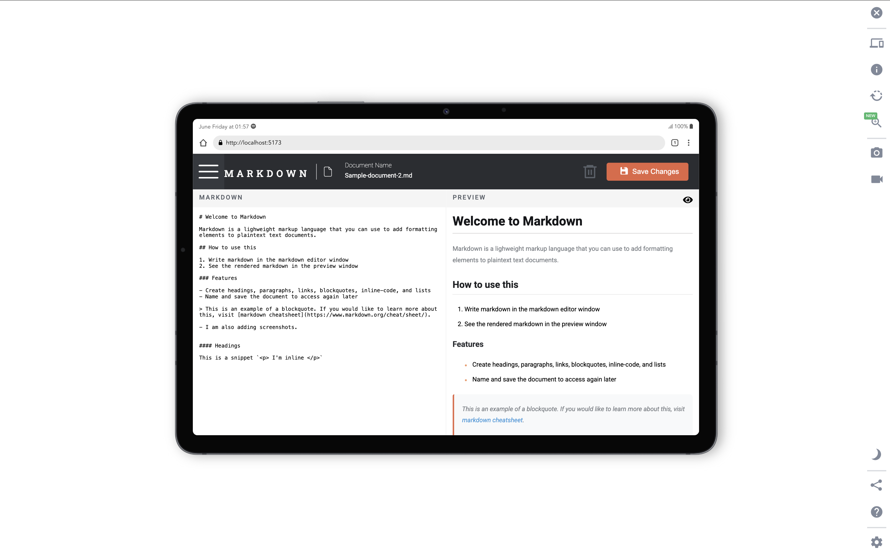

# In-browser markdown editor solution

This is a solution to the [In-browser markdown editor](https://github.com/Aayush895/Markdown-Editor).

## Table of contents

- [In-browser markdown editor solution](#in-browser-markdown-editor-solution)
  - [Table of contents](#table-of-contents)
  - [Overview](#overview)
    - [The challenge](#the-challenge)
    - [Screenshot](#screenshot)
    - [Links](#links)
  - [My process](#my-process)
    - [Built with](#built-with)
    - [What I learned](#what-i-learned)
  - [Author](#author)

## Overview

### The challenge

Users should be able to:

- Create, Read, Update, and Delete markdown documents
- Name and save documents to be accessed as needed
- Edit the markdown of a document and see the formatted preview of the content
- View a full-page preview of the formatted content
- View the optimal layout for the app depending on their device's screen size
- See hover states for all interactive elements on the page
- This project is built as a full-stack application

### Screenshot

### Links

- Solution URL: [Github](https://github.com/Aayush895/Markdown-Editor)
- Live Site URL: [Add live site URL here](https://your-live-site-url.com)

## My process

### Built with

- Semantic HTML5 markup
- CSS
- Flexbox
- CSS modules
- Mobile-first workflow
- [React](https://reactjs.org/) - JS library
- Express
- Node
- Mongodb

### What I learned

- Learned how to create an entire full-stack application that can perform CRUD operations.
- Learned how to setup an express server along with database.
- Learned how to create a fully responsve react application and merge it with backend server.
- Learned how to make my application modular.

## Author

- Github - [@Aayush895](https://github.com/Aayush895)